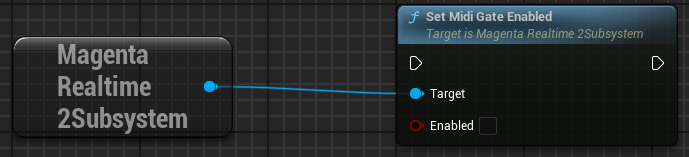

# MIDI Input

## MIDI Note ON/OFF

{ loading=lazy }  

Execute the `set_note_on`/`set_note_off` functions to inform the model that a note with the specified number has been turned ON or OFF.

- **N**: MIDI Note Number (0–127)

## MIDI Note Masking

{ loading=lazy }  

Notes within `unmask_width` range before and after the MIDI notes set to "ON" via `set_note_on` are input to the model as "OFF".  
The remaining notes are input to the model as "Masked".

The model is guided to play the notes set to "ON" and avoid playing notes set to "OFF".

{ loading=lazy }  

Set `unmask_width` using the `set_unmask_width` function. The default value for `unmask_width` is 0.

!!! Info "Solo Mode"
    Setting `unmask_width` to 127 disables masking for all keys, guiding the model to play only the MIDI notes explicitly set to "ON".

    The setting to set `unmask_width` to 127 is implemented as a toggle button named "Solo" in the official Magenta Realtime 2 sample interface.

## MIDI Onset Mode

{ loading=lazy }  

Specify the behavior when holding down a note using the `set_onset_mode` function. The default value for onset mode is False.

- **False**: Pressing down a note and continuously holding it are not distinguished internally; both are treated simply as Active. When holding down a note, it allows the model to repeatedly play that note (Auto-strum).
- **True**: Pressing down a note (onset) and continuously holding it (continuation) are distinguished internally before being input into the model. When holding down a note, the model does not repeatedly re-trigger that note.

## MIDI Gate

{ loading=lazy }  

Specifying True for `set_midi_gate_enabled` mutes generated audio whenever no MIDI notes are currently held down.  
This setting is useful if you want to play Magenta Realtime 2 interactively like an instrument.  
The default value is False.

Note that audio generation continues internally even while muted.