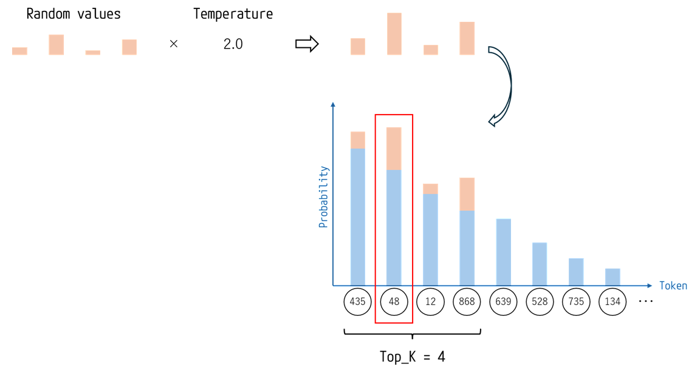
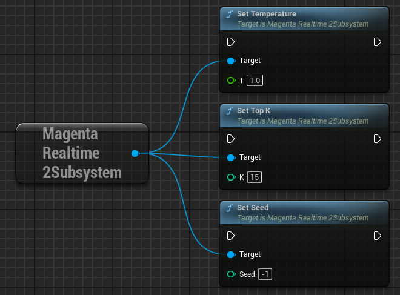

# Other Inputs

## Drums On/Off

{ loading=lazy }  

Whether to include drums in the generated audio.

- **False**: Allows drums to be included in the generated audio.
- **True**: Instructs the model not to include drums in the generated audio.

## Conditioning Strength (CFG) for Each Input

{ loading=lazy }  

- **CFG Musiccoca**: Controls how strongly the model follows your text/audio prompts (-1 to 7). Default is 3. Higher values stick closely to the prompt but may reduce audio quality, while lower values prioritize musicality over strict accuracy.
- **CFG Notes**: Controls how strongly the model adheres to your input notes (-1 to 7). Default is 5. Higher values force strict compliance, while lower values allow the model more creative drift.
- **CFG Drums**: Controls how strongly the model follows drums inclusion/exclusion (-1 to 7). Default is 1.

## Adjusting Randomness

Magenta Realtime 2 generates audio by predicting tokens for the next frame.

Random noise is added to the probabilities of the top-K highest-probability candidate tokens for the next frame, and the token with the highest probability is selected.  
The intensity of this random noise is called Temperature.

{ loading=lazy }  

In this plugin, you can adjust the randomness of the generated audio using the following three parameters:

- **Temperature**: Noise scale. Larger values result in more random outputs. A value of 0 results in deterministic generation without randomness.
- **Top K**: The number of top candidate tokens to sample the next token from. Larger values increase randomness. A value of 1 results in deterministic generation.
- **Seed**: Noise seed. Changing the seed yields different generation variations. A value of -1 makes the seed itself random.

{ loading=lazy }  