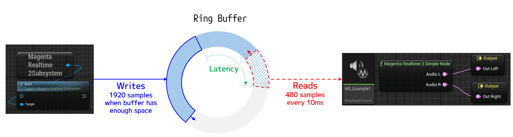
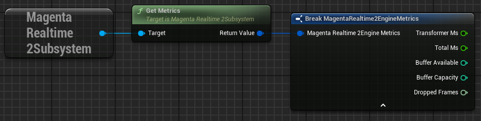

# Performance

## Buffer Size

{ loading=lazy }  

Generated audio is written into a dedicated ring buffer, from which the MetaSound node reads the audio data.

- **Generation & Writing**

    Audio is generated in minimum units of 40ms = 1,920 samples (the sampling rate of the generated audio is 48,000Hz).  
    The audio generation thread generates and writes audio whenever there is sufficient space in the ring buffer to write 1,920 samples.  
    (Therefore, when audio is not playing, the ring buffer quickly becomes full, and audio generation pauses.)

- **Reading & Playback**

    The MetaSound node reads audio data from the ring buffer every 10ms = 480 samples and actually plays back the audio.

- **Latency**

    Because writing and reading are asynchronous, latency occurs between them. If generation speed exceeds playback speed, **a larger ring buffer size results in higher latency**.

{ loading=lazy }  

You can specify the ring buffer size using the `set_buffer_size` function. Reducing the buffer size decreases latency, but increases the chance of audio dropping out under heavy load.  

| Buffer Size | Latency |
|--|--|
| 2048 | 43ms |
| 4096 | 85ms |
| 8192 | 170ms |

??? Info "Configuring Default Buffer Size"

    You can configure the default buffer size at engine startup under "Project Settings > Plugins > Magenta Realtime 2 > Default Buffer Size".

    { loading=lazy }  

## Switching FP16 / FP32

By default, this plugin uses 16-bit float (FP16) for part of the audio generation computations, primarily to reduce GPU memory usage.

You can switch between 16-bit float and 32-bit float by editing line 20 of `<Engine Installation Folder>/Plugins/Marketplace/MagentaRealtime2/Source/MagentaRealtime2/MagentaRealTime2.Build.cs` as follows:

- **16-bit float**: `bool doUseFP16 = true;`
- **32-bit float**: `bool doUseFP16 = false;`

After changing the above setting, you must rebuild the plugin. Note that saved [model states](./state.md) are not compatible between 16-bit float and 32-bit float.

## Get Metrics

{ loading=lazy }  

Retrieves measurement results of the music generation process.

- **transformer_ms**: Time taken to execute the AI model for the latest single frame (in milliseconds)
- **total_ms**: Total time taken for the overall generation process of the latest single frame (retrieving input values + executing the model) (in milliseconds)
- **buffer_available**: Available remaining capacity of the ring buffer
- **buffer_capacity**: Total capacity of the ring buffer
- **dropped_frames**: Number of times reading failed because generation could not keep up when attempting to read audio data from the ring buffer

Note that one frame corresponds to 40ms of audio data. Therefore, if `total_ms` is less than 40ms, the execution speed is fast enough for real-time playback.