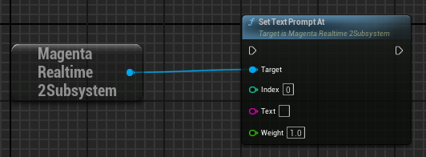
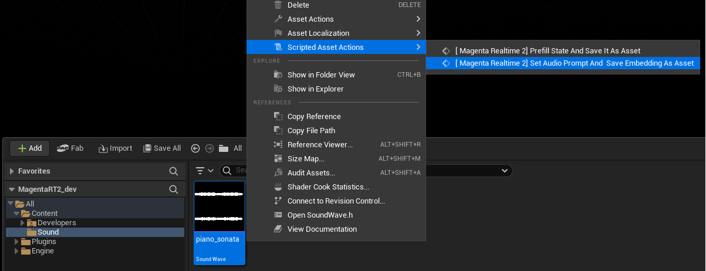
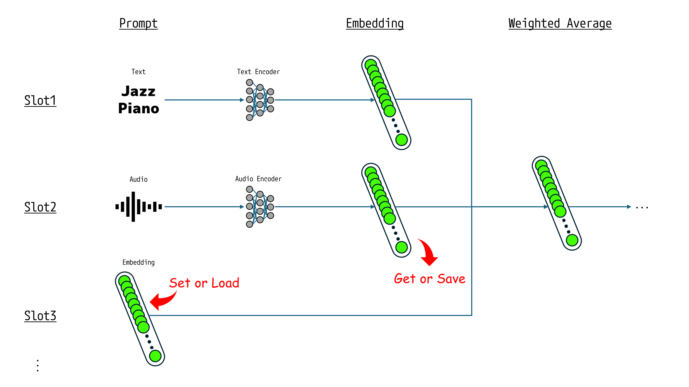
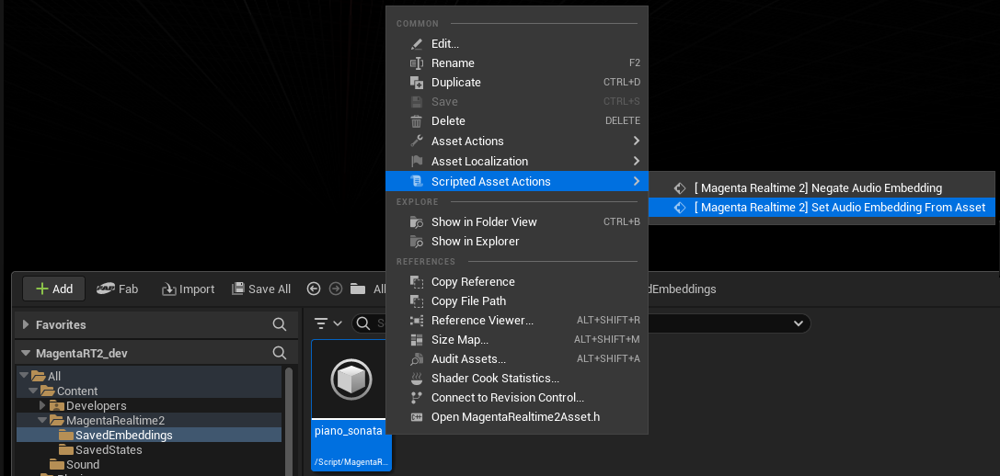

# Set Prompts

Magenta Realtime 2 has 6 prompt slots. Each prompt is weighted and averaged according to user-specified weights before being passed as input to the model.

{ loading=lazy }

You can input prompts into each slot using the following 3 methods:

- Text
- Audio
- Embedding

## Text

{ loading=lazy }  

Execute the `set_text_prompt_at` function.

- **Index**: The prompt slot index (0–5).
- **Text**: The prompt string (e.g., "Jazz Piano Trio").
- **Weight**: The weight of the prompt.

## Audio

You can use 10-second mono audio sampled at 16,000 Hz as a prompt.

### Using Sound Wave

{ loading=lazy }

Execute the `set_audio_prompt` function.

- **Index**: The prompt slot index (0–5).
- **Sound Wave**: A stereo or mono audio. It will be downmixed internally to 16 kHz mono.
- **Trim**: Whether to use the first 10 seconds or the last 10 seconds of the Sound Wave.

??? Info "Use asset by right-clicking in the Editor"

    Right-click a SoundWave asset in the Unreal Editor Content Browser and select "Scripted Asset Actions > [ Magenta Realtime 2] Set Audio Prompt And Save Embedding As Asset". This executes `set_audio_prompt` for slot 0 using the specified asset. Furthermore, after execution, the [audio embedding](#embeddings) is saved to `Content > MagentaRealtime2 > SavedEmbeddings`.

    { loading=lazy }

### Using WAV File

{ loading=lazy }  

Execute `set_audio_prompt_samples` by passing 16 kHz mono waveform data loaded via functions such as "Load Wave File".

- **Index**: The prompt slot index (0–5).
- **Filename**: Used as the return value of `get_cached_text`. It is recommended to specify a filename.
- **Samples**: 16 kHz mono waveform data.
- **Trim**: Whether to use the first 10 seconds or the last 10 seconds of Samples.

## Embeddings

Audio prompts have a limitation: processing audio through an encoder takes time. To avoid this, you can save the "embedding" (an array of 768 float values) obtained after processing the audio through the encoder, and input it directly in place of the prompt.

{ loading=lazy }  

### Using Raw Values

{ loading=lazy }  

Use the `get_audio_embedding` function to retrieve the raw embedding values.

- **Index**: The slot index (0–5) to retrieve the embedding from. An audio prompt must be set in the specified slot beforehand.

Use the `set_audio_embedding` function to set the raw embedding values.

- **Index**: The slot index (0–5) to set the embedding into.
- **Embedding**: The embedding values retrieved via `get_audio_embedding`.
- **Do Reblend**: Whether to immediately recalculate the weighted average and reflect the result in audio generation after setting the embedding. Typically True. If you set weights separately via `set_weight`, setting this to False avoids redundant recalculations.

### Using Assets

{ loading=lazy }  

Use the `save_audio_embedding_to_asset` function to save the embedding as an asset.

- **Index**: The slot index (0–5) to retrieve the embedding from. An audio prompt must be set in the specified slot beforehand.
- **PackagePath**: The destination asset path.

Use the `load_audio_embedding` function to load the embedding from an asset.

- **Index**: The slot index (0–5) to set the embedding into.
- **Saved Embedding**: The asset to load.
- **Do Reblend**: Whether to immediately recalculate the weighted average and reflect the result in audio generation.

??? Info "Use asset by right-clicking in the Editor"

    Right-click a `MagentaRealtime2SavedEmbedding` asset in the Unreal Editor Content Browser and select "Scripted Asset Actions > [ Magenta Realtime 2] Set Audio Embedding From Asset". This executes `load_audio_embedding` for slot 0 using the specified asset.

    { loading=lazy }

### Using SaveGame

{ loading=lazy }  

Create a `MagentaRealtime2SavedEmbedding` object using `CreateSaveGameObject`, write embedding data into it using `save_audio_embedding`, and then save it using `SaveGameToSlot` like a standard SaveGame object.

When loading, cast the loaded SaveGame from `LoadGameFromSlot` to `MagentaRealtime2SavedEmbedding`, and pass it to `load_audio_embedding` to apply the embedding.

