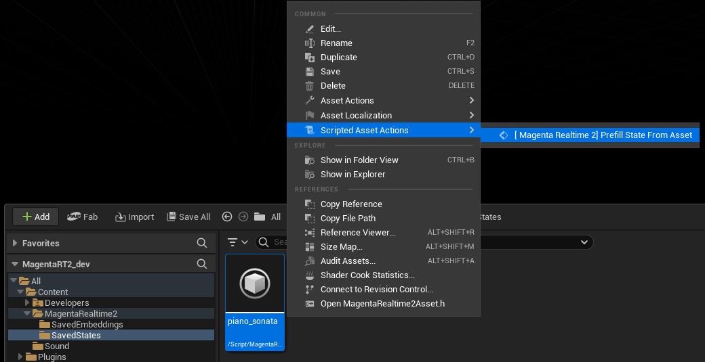
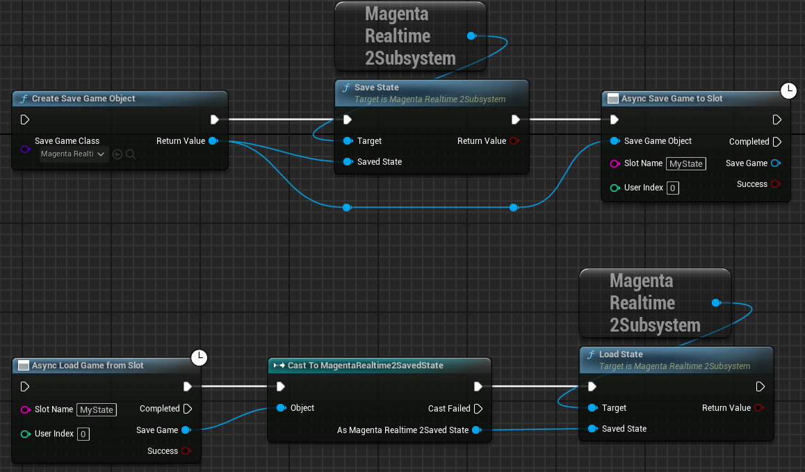
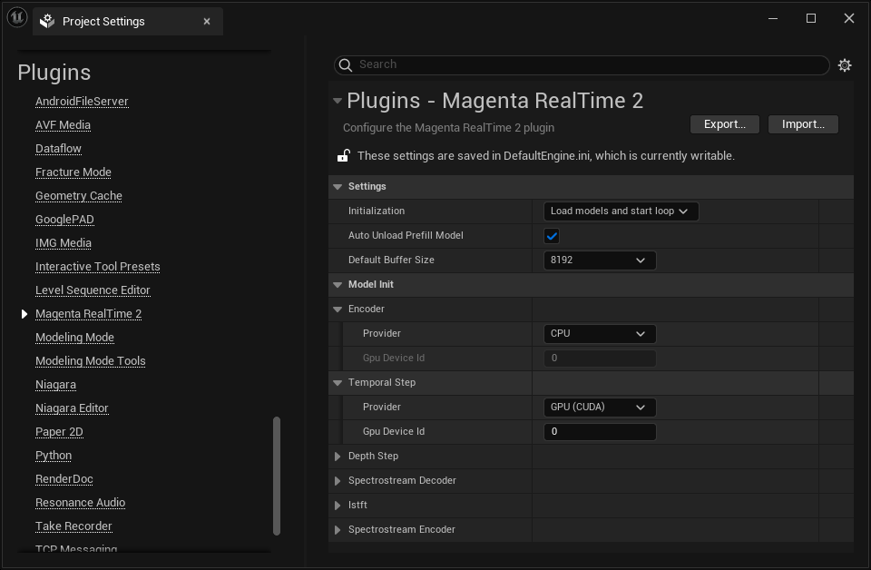
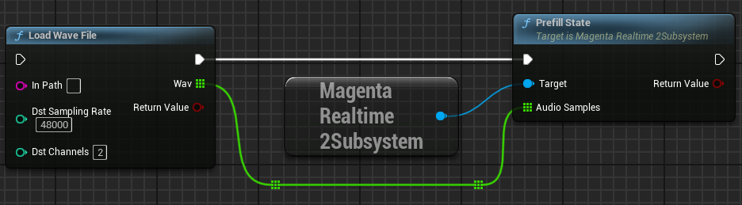
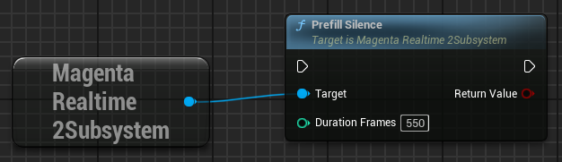
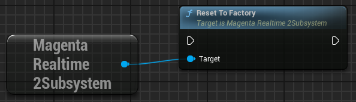
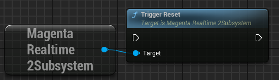

# Model State

Magenta Realtime 2 generates audio for the next frame based on (1) various inputs such as prompts and (2) the generation results of the last 42 frames (1 frame = 40ms).

Information about the audio generation results from the last 42 frames is stored internally as a KV cache. In Magenta Realtime 2, this cache is referred to as the model state.

## Saving & Loading State

By saving and loading the model state, you can resume audio generation from a specific point in time mid-generation.

### Saving State to an Asset

{ loading=lazy }  

Executing the `save_state_to_asset` function saves the current model state as a `MagentaRealtime2SavedState` asset at the specified path.

Loading the state with the `load_state` function from a specified `MagentaRealtime2SavedState` asset allows you to resume generation from that saved state.

??? Info "Use asset by right-clicking in the Editor"

    Right-clicking a `MagentaRealtime2SavedState` asset in the Unreal Editor Content Browser and selecting "Scripted Asset Actions > [ Magenta Realtime 2] Prefill State From Asset" executes the `load_state` function with the specified asset.

    { loading=lazy }

### Saving State to SaveGame

{ loading=lazy }  

Create a `MagentaRealtime2SavedState` object with `CreateSaveGameObject`, write the state into it using `save_state`, and save it using `SaveGameToSlot` just like a standard SaveGame.

When loading, cast the SaveGame loaded with `LoadGameFromSlot` to `MagentaRealtime2SavedState`, and pass it to `load_state` to restore the state.

## Setting State from Audio

By creating a model state for specified audio as if it had just finished generating that audio, you can easily guide the model to generate similar audio.

??? Info "Automatic Loading & Unloading of Prefill Model"

    - To set the state from audio, the model for processing audio (Prefill model) must be loaded into memory. Executing `prefill_state_with_asset` or `prefill_state` when the Prefill model is not yet loaded automatically loads the model internally.
    - If "Auto Unload Prefill Model" in "Project Settings > Plugins > Magenta Realtime 2" is set to "True (default value)", the Prefill model is automatically unloaded upon completion of `prefill_state_with_asset` or `prefill_state`. It defaults to True to prevent memory pressure.

        { loading=lazy }  

    - To manually load the Prefill model, execute `load_prefill_model`. To manually unload it, execute `unload_prefill_model`.

??? Warning "When Audio Files Are Too Long"

    - Depending on GPU memory capacity, processing may fail if the audio file is too long. In that case, please trim the audio file to around 20 seconds before processing.

### Setting from SoundWave

{ loading=lazy }  

Executing `prefill_state_with_asset` overwrites the model state using audio from the specified SoundWave file.

- **Sound Wave**: Stereo or mono audio. Internally converted to 48kHz stereo audio. A length of around 20 seconds is sufficient to overwrite the model state.

??? Info "Use asset by right-clicking in the Editor"

    Right-clicking a SoundWave asset in the Unreal Editor Content Browser and selecting "Scripted Asset Actions > [ Magenta Realtime 2] Prefill State And Save It As Asset" executes `prefill_state_with_asset` for the specified asset. Additionally, [Save State to Asset](#saving-state-to-an-asset) is executed after processing, saving a `MagentaRealtime2SavedState` asset under `Content > MagentaRealtime2 > SavedStates`.

    { loading=lazy }

### Setting from WAV File

{ loading=lazy }  

Executing `prefill_state` with 48kHz stereo waveform data loaded via "Load Wave File" or similar functions overwrites the model state with the specified WAV file.

- **Audio Samples**: 48kHz stereo waveform data. A length of around 20 seconds is sufficient to overwrite the model state.

## Setting State to Silence

{ loading=lazy }  

Executing `prefill_silence` sets the state to immediately following the generation of silence for the frame count specified by **DurationFrames**. This allows audio generation to start from a completely silent state.

## Resetting State to Factory Default

{ loading=lazy }  

Discards the current cache and restores the initial state when the model was loaded. Note that this is different from a silent state.

## Resetting State

{ loading=lazy }  

Discards the current state and reverts to whichever of the following states was executed last:

- State loaded via `load_state`
- State configured from audio via `prefill_state`, etc.
- Silent state configured via `prefill_silence`
- Initial state configured via `reset_to_factory`

If none of the above have been executed yet, it reverts to the factory initial state just like `reset_to_factory`.