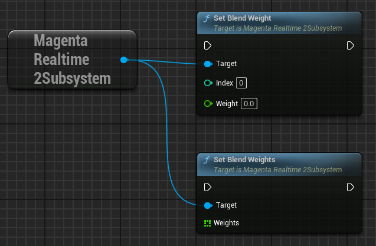
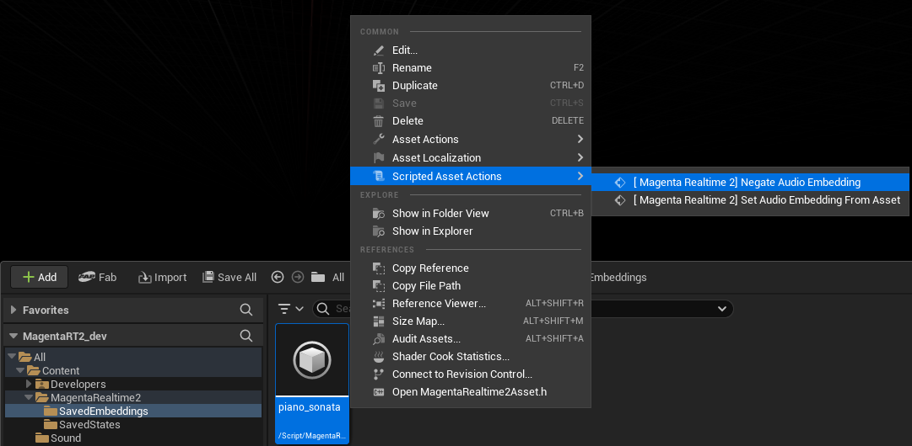

# Set Weight

Sets the contribution of the each prompt as a weight.

{ loading=lazy }  

You can set the weight for an individual slot using the `set_blend_weight` function.

- **Index**: The slot index (0–5) to set the weight for.
- **Weight**: Weight value.

You can set weights for all slots at once using the `set_blend_weights` function. When modifying weights for multiple slots, this is more efficient because internal recalculation is performed only once.

- **Weights**: Array of weights. Element index corresponds to slot index. Elements beyond the 6th (index 6+) are ignored.

!!! Info "Normalization"
    
    Weights are normalized internally so that the sum of the absolute values of all slot weights equals 1.

!!! Info "Negative Weights"

    In this plugin, Magenta Realtime 2 itself has been modified so that the normalization process functions properly even when negative values are set as weights. By setting negative values, the prompt is expected to act as a "negative prompt", but this is an experimental feature.

    ??? Info "Negating the Sign of Saved Embeddings"

        Right-clicking a `MagentaRealtime2SavedEmbedding` asset in the Unreal Editor Content Browser and selecting "Scripted Asset Actions > [ Magenta Realtime 2] Negate Audio Embedding" multiplies each float value of the specified embedding by -1 and saves it. This produces the same behavior as setting a negative weight.

        { loading=lazy }  