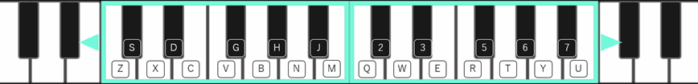

# デモ

<iframe width="560" height="315" src="https://www.youtube.com/embed/OdqQR27XlQ8" title="YouTube video player" frameborder="0" allow="accelerometer; autoplay; clipboard-write; encrypted-media; gyroscope; picture-in-picture" allowfullscreen></iframe>

デモには上記動画前半の「プロンプトブレンド」や「MIDI入力」を試せる機能が含まれています。

## ダウンロード

EXE形式のデモプロジェクトを[こちら](https://github.com/Akiya-Research-Institute/MagentaRealtime2-Demo-UE5/releases)からダウンロードできます。

## GitHubソース

デモのUE5プロジェクトファイルを[GitHubで公開](https://github.com/Akiya-Research-Institute/MagentaRealtime2-Demo-UE5)しています。

## ソフトウェア要件

- Windows 64bit
- Unreal Engine 5.8.0
- Magenta Realtime 2 Plugin for UE v1.0以上
- CUDA: 12.8.2
- cuDNN: 9.23

CUDAとcuDNNのインストール方法は[こちら](../install)をご覧ください。

## ハードウェア要件

- CUDA Architecture 7.5 (RTX 2000シリーズ) 以降のNVIDIA GPUが必要です。

## キーボード入力

PCのキーボードがソフトウェア上の鍵盤と下記のように対応しています。

{ loading=lazy }  

矢印キーの左右を押すと、対応する鍵盤が1オクターブ上下にシフトします。