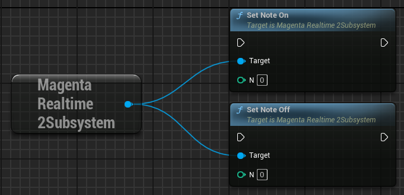
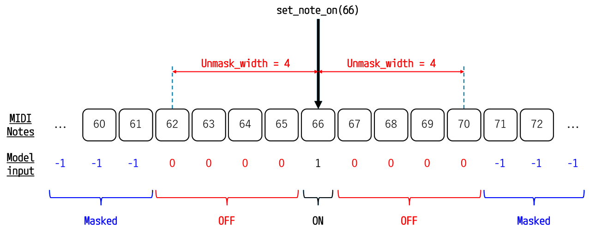
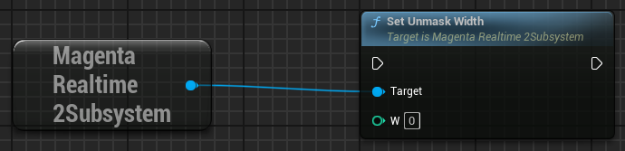
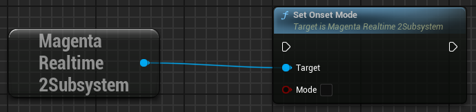

# MIDI入力

## MIDIノートのON/OFF

{ loading=lazy }  

set_note_on/set_note_off関数を実行することで、その番号のノートをON/OFFしたことをモデルに伝えます。

- **N**: MIDIノートナンバー（0-127）

## MIDIノートのマスク

{ loading=lazy }  

set_note_onで「ON」に指定されたMIDIノートの前後 unmask_width 分のノートが「OFF」としてモデルに入力されます。  
残りのノートは「Masked」としてモデルに入力されます。

モデルは、「ON」のノートの音を鳴らし、「OFF」のノートの音は鳴らさないように誘導されます。

{ loading=lazy }  

unmask_widthは、set_unmask_width関数で設定します。unmask_widthの初期値は0です。

!!! Info "Soloモード"
    unmask_widthを127にすると、全てのキーについてマスクが無効になり、モデルは「ON」に指定されたMIDIノートだけを鳴らすように誘導されます。

    unmask_widthを127にする設定は、Magenta Realtime 2の公式サンプルでは「Solo」という名前のトグルボタンに実装されています。

## MIDIオンセット

{ loading=lazy }  

ノートを押し続けたときの動作をset_onset_mode関数で指定します。オンセットモードの初期値はFalseです。

- **False**: ノートの押下と、その後の押し続けている状態が内部で区別されず両方とも単にActiveとして処理されます。ノートを押し続けたときに、モデルがそのノートを繰り返し鳴らす（Auto-strum）ことを許可します。
- **True**: ノートの押下(onset)と、その後の押し続けている状態(continuation)が内部で区別されてモデルに入力されます。ノートを押し続けたときに、モデルがそのノートを繰り返し鳴らさなくなります。

## MIDIゲート

{ loading=lazy }  

set_midi_gate_enabledでTrueを指定すると、いずれのMIDIノートも押下されていないときは生成された音声をミュートするようになります。  
楽器のようにMagenta Realtime 2を使用したい場合に有効かもしれない設定です。  
初期値はFalseです。

なお、ミュートされている間も内部的には音声を生成しつづけています。