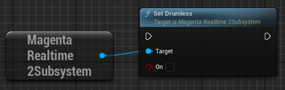
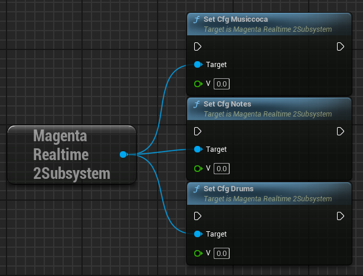

# その他の入力

## ドラム有無

{ loading=lazy }  

生成する音声にドラムを含めるかどうかを指示します。

- **False**: 生成する音声にドラムが含まれることを許可します。
- **True**: 生成する音声にドラムが含まれないよう指示します。

## 各入力の指示の強さ

{ loading=lazy }  

- **CFG Musiccoca**: プロンプトによる指示の強さ（-1 ～ 7）。デフォルトでは3。値が大きいほどプロンプトにしたがいますが、音声の品質が下がる場合があります。値が小さいと音楽性を優先しますがプロンプトへの追従性は下がります。
- **CFG Notes**: MIDIノートの入力による指示の強さ（-1 ～ 7）。デフォルトでは5。
- **CFG Drums**: ドラム有無の指示の強さ（-1 ～ 7）。デフォルトでは1。

## ランダム性の調整

Magenta Realtime 2は、モデルが次フレームのトークンを予想することにより音声を生成します。

次フレームのトークンの候補の中から、最も確率の高い上位K個のトークンの確率にランダムなノイズを加えた値が最も高いトークンが、次フレームのトークンとして選択されます。  
ランダムなノイズの強度はTemperatureと呼ばれます。

{ loading=lazy }  

本プラグインでは、生成される音声のランダム性を下記の3つのパラメータで調整できます。

- **Temperature**: ノイズのスケールです。大きいほどランダムな結果となり、0の場合はランダム性のない生成結果となります。
- **Top K**: 上位何個のトークンから次のトークンを選択するかを指定します。大きいほどランダムな結果となり、1の場合はランダム性のない生成結果となります。
- **Seed**: ノイズのシードです。シードを変更することで様々なバリエーションの生成結果が得られます。-1の場合は、シード自体がランダムとなります。

{ loading=lazy }  