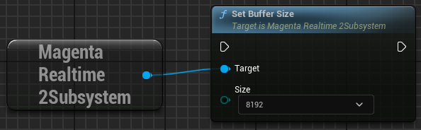

# パフォーマンス改善・測定

## バッファサイズ

{ loading=lazy }  

生成された音声は専用のリングバッファに書き込まれ、MetaSoundノードがここから音声データを読み出します。

- **生成・書き込み**

    音声は40ms=1920サンプルを最小単位に生成されます（生成される音声のサンプリングレートは48000Hzです）。  
    音声生成用のスレッドは、リングバッファに1920サンプルを書き込むだけの余裕があるときに音声を生成し、書き込みを行います。  
    （このため、音声の再生をしていないときは、リングバッファがすぐに満杯になり、音声の生成も停止します）

- **読み出し・再生**

    MetaSoundノードは10ms=480サンプルごとにリングバッファから音声データを読み出し、実際に音声を再生します。

- **遅延（Latency）**

    書き込みと読み出しは同期していないため、これらの間には遅延があります。生成速度が再生速度を上回っている場合、**リングバッファのサイズが大きいほど遅延が大きくなります**。

{ loading=lazy }  

set_buffer_size関数でリングバッファのサイズを指定できます。サイズを小さくすると遅延は減りますが、負荷が高まったときに音声が途切れる可能性が高まります。  

| Buffer Size | Latency |
|--|--|
| 2048 | 43ms |
| 4096 | 85ms |
| 8192 | 170ms |

??? Info "デフォルトのバッファサイズの設定"

    「Project Settings > Plugins > Magenta Realtime 2」の「Default Buffer Size」で、エンジン起動時のデフォルトのバッファサイズを設定できます。

    { loading=lazy }  

## FP16/FP32の切り替え

本プラグインはデフォルトでは、主にGPUメモリの使用量を削減する目的で、音声生成処理の計算の一部で16-bit Float値を用いています。

プラグインの「<Engine Installation Folder>/Plugins/Marketplace/MagentaRealtime2/Source/MagentaRealtime2/MagentaRealTime2.Build.cs」の20行目を下記のように編集することで、16-bit Floatを用いるか32-bit Floatを用いるかを切り替えることができます。

- **16-bit float**: `bool doUseFP16 = true;`
- **32-bit float**: `bool doUseFP16 = false;`

上記の切り替えを行ったあとは、プラグインの再ビルドが必要です。また、[モデルの状態](./state.md)は、16-bit Floatと32-bit Floatの間で互換性がないことにご注意ください。

## メトリクスの取得

{ loading=lazy }  

音楽生成処理の測定結果を取得します。

- **transformer_ms**: 直近1フレームのAIモデルの実行に要した時間（ミリ秒）
- **total_ms**: 直近1フレームの生成処理全体（モデルへ入力する各種の値を取得 + モデル実行）に要した時間（ミリ秒）
- **buffer_available**: リングバッファの空き容量
- **buffer_capacity**: リングバッファの全容量
- **dropped_frames**: 音声データをリングバッファから読み出そうとしたが、生成が間に合っておらず読み出しに失敗した回数

なお、1フレームは40ms分の音声データです。したがって、total_msが40msより小さければリアルタイム再生に十分な速度が出ているということになります。