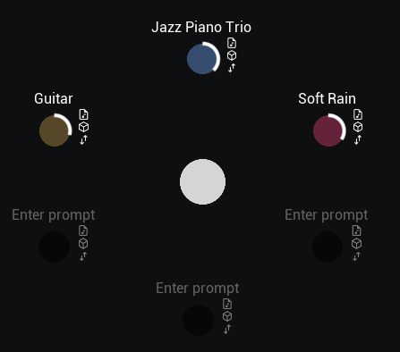
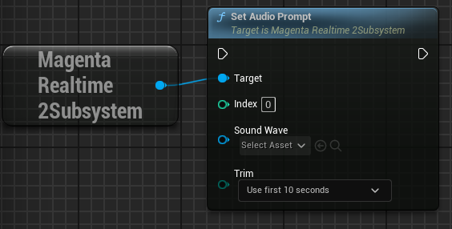
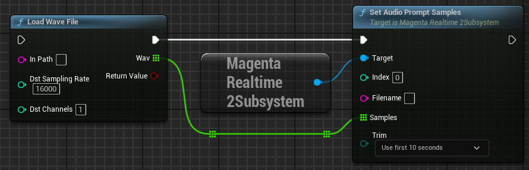
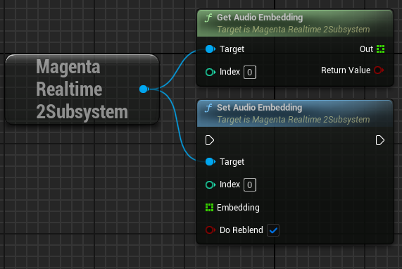
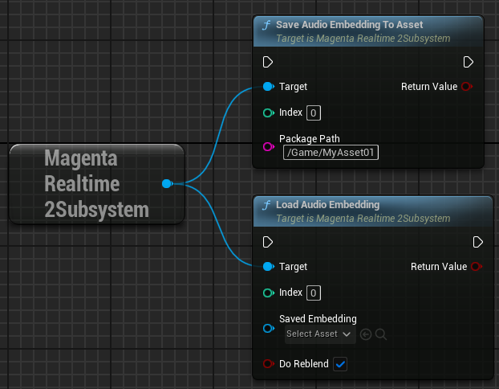
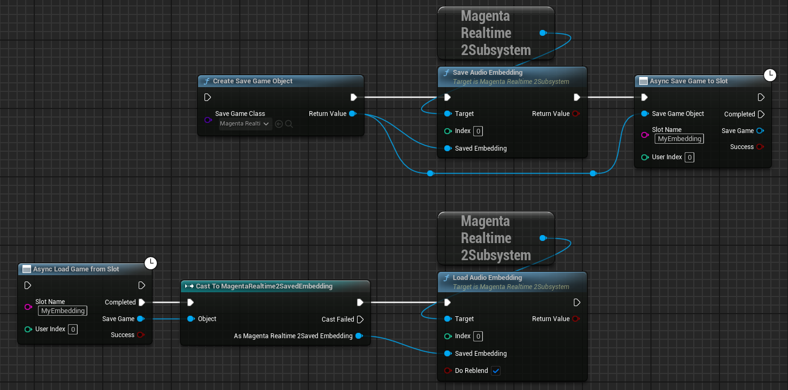

# プロンプトの設定

MagentaRealtime2には、プロンプトを入れるスロットが6個あります。それぞれのプロンプトはユーザが指定した重みで加重平均されてモデルの入力に使用されます。

{ loading=lazy }

各スロットに、下記の3つの方法でプロンプトを入力することができます。

- テキスト (Text)
- 音声 (Audio)
- 埋め込み表現 (Embedding)

## テキスト

{ loading=lazy }  

set_text_prompt_at関数を実行します。

- **Index**: プロンプトを入力するスロットを指定します（0-5）
- **Text**: プロンプトとなる文字列を指定します（例：「Jazz Piano Trio」）
- **Weight**: プロンプトの重みを指定します。

## 音声

16000Hzモノラル10秒間の音声をプロンプトとして使用できます。

### Sound Waveを使用

{ loading=lazy }

set_audio_prompt関数を実行します。

- **Index**: プロンプトを入力するスロットを指定します（0-5）
- **Sound Wave**: ステレオまたはモノラルの音声を指定します。内部的に16kHzモノラルにダウンミックスされます
- **Trim**: Sound Waveの最初の10秒を使うか、最後の10秒を使うかを指定します

??? Info "エディタ上でアセットを右クリックして使用"

    UnrealエディタのコンテンツブラウザでSoundWaveアセットを右クリックし「Scripted Asset Actions」から「[ Magenta Realtime 2] Set Audio Prompt And Save Embedding As Asset」を実行すると、スロット0に対して指定したアセットでset_audio_prompt関数が実行されます。さらに、実行後に[埋め込み表現](#_4)が「Content > MagentaRealtime2 > SavedEmbeddings」に保存されます。

    { loading=lazy }

### wavファイルを使用

{ loading=lazy }  

「Load Wave File」などで読み込んだ16kHzモノラルの波形データを引数に「set_audio_prompt_samples」を実行します。

- **Index**: プロンプトを入力するスロットを指定します（0-5）
- **Filename**: get_cached_textの戻り値として使われます。ファイル名を指定しておくことが推奨。
- **Samples**: 16kHzモノラルの波形データを入力します
- **Trim**: Samplesの最初の10秒を使うか、最後の10秒を使うかを指定します

## 埋め込み表現

音声によるプロンプトは、音声をエンコーダで処理するのに時間がかかるという問題があります。これを回避するために、音声をエンコーダで処理した後の「埋め込み表現」(実体は768個のFloat値) を保存しておき、それを直接プロンプトの代わりに入力するというのがこの方式です。

{ loading=lazy }  

### 値を直接扱う場合

{ loading=lazy }  

get_audio_embedding関数で、埋め込み表現の値を直接取得できます。

- **Index**: 埋め込み表現を取得するスロットを指定します（0-5）。指定スロットには事前に音声によるプロンプトが設定されている必要があります。

set_audio_embedding関数で、埋め込み表現の値を直接セットできます。

- **Index**: 埋め込み表現をセットするスロットを指定します（0-5）
- **Embedding**: get_audio_embedding関数で取得して置いた埋め込み表現を入力します
- **Do Reblend**: 埋め込み表現をセットした後、すぐに加重平均の再計算を行い、音声生成に結果を反映するか。通常Trueで問題ないですが、重みを別途set_weight関数などで指定する場合はそちらで再計算と反映が行われるのでFalseにしておくと無駄な処理が減ります。

### アセットで扱う場合

{ loading=lazy }  

save_audio_embedding_to_asset関数で、埋め込み表現をアセットとして保存できます。

- **Index**: 埋め込み表現を取得するスロットを指定します（0-5）。指定スロットには事前に音声によるプロンプトが設定されている必要があります。
- **PackagePath**: アセット保存先のパスを指定します

load_audio_embedding関数で、埋め込み表現をアセットからロードできます。

- **Index**: 埋め込み表現をセットするスロットを指定します（0-5）
- **Saved Embedding**: 読み込みたいアセットを指定します
- **Do Reblend**: 埋め込み表現をセットした後、すぐに加重平均の再計算を行い、音声生成に結果を反映するか。通常Trueで問題ないですが、重みを別途set_weight関数などで指定する場合はそちらで再計算と反映が行われるのでFalseにしておくと無駄な処理が減ります。

??? Info "エディタ上でアセットを右クリックして使用"

    UnrealエディタのコンテンツブラウザでMagentaRealtime2SavedEmbeddingアセットを右クリックし「Scripted Asset Actions」から「[ Magenta Realtime 2] Set Audio Embedding From Asset」を実行すると、スロット0に対して指定したアセットでload_audio_embedding関数が実行されます。

    { loading=lazy }

### SaveGameで扱う場合

{ loading=lazy }  

CreateSaveGameObject関数で MagentaRealtime2SavedEmbedding オブジェクトを作成し、これを引数にsave_audio_embedding関数で埋め込み表現を書き込んだ後、通常のSaveGameと同様にSaveGameToSlotで保存します。

読み込み時は、LoadGameFromSlotで読み込んだSaveGameを MagentaRealtime2SavedEmbedding にキャストし、これを引数にload_audio_embedding関数で埋め込み表現を設定できます。

