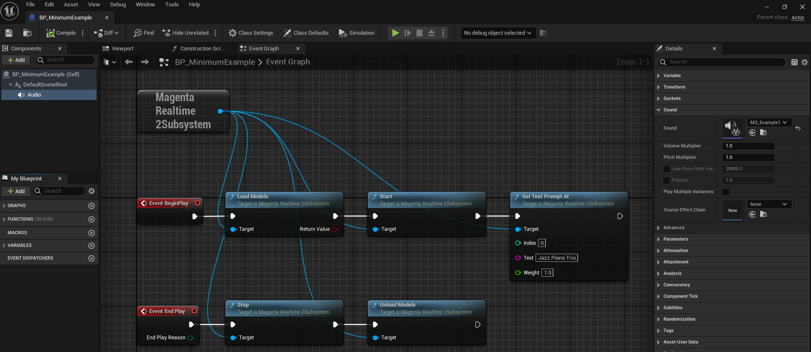

# クイックスタート

プラグインコンテンツの「MagentaRealtime2 > BP_MinimumExample」をご覧ください。

{ loading=lazy }

## BeginPlay

- 最初に、「load_models」関数で音楽生成に必要なAIモデルをメモリに読み込みます。
- 「start」関数で音楽生成用のスレッドを開始します。
- 「set_text_prompt_at」関数でプロンプトを設定します。

## Play

- Audioコンポーネントの「Sound」に「MS_Example1」を設定します。この中で生成した音声が再生されます。

## EndPlay

- 「stop」関数で音楽生成用のスレッドを停止します。
- 「unload_models」関数で音楽生成に必要なAIモデルをメモリから解放します。

??? Info "モデルの読み込み・解放"
    - モデルがまだ読み込まれていない状態で「start」を実行すると、内部で自動的にモデルが読み込まれます。
    - UE終了時に自動的にモデルが解放されます。
    - 「Project Settings > Plugins > Magenta Realtime 2」の「Initialization」に、「Load models」または「Load models and start loop (デフォルト値)」を設定すると、UE起動時に自動的にモデルが読み込まれます。「Load models and start loop」の場合は、「start」関数も自動で実行されます。

        { loading=lazy }  

    - プロジェクト設定の「Model Init」以下の項目で、使用するモデルをCPUで実行するかGPU(CUDA)で実行するかを指定できます。GPU(CUDA)で実行する場合はさらにGPUのデバイスIDを指定できます。通常はデフォルト値で問題ありません。一部のモデルはCPUでの実行に対応していないことに注意してください。

??? Info "APIリファレンス"
    - C++ (あるいはAI向け) には、「MagentaRealtime2Subsystem.h」をご覧いただくとほぼ全ての機能がわかります。
    - BP向けには、プラグインコンテンツの「MagentaRealtime2 > Example1 > WB_Example1」が基本的な使い方をほぼ網羅しているので参考にしてください。
