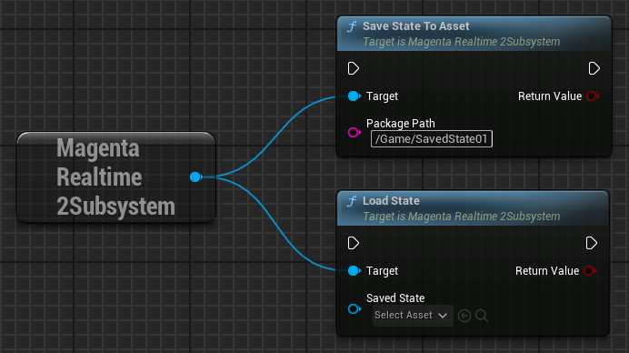
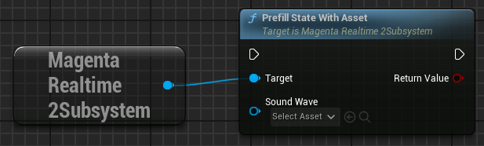
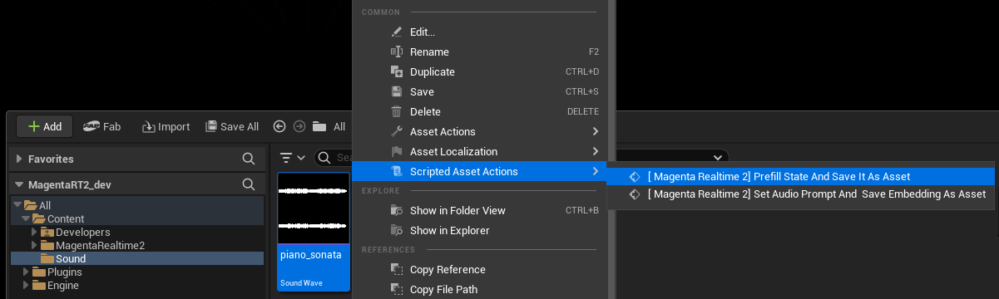

# モデルの状態

Magenta Realtime 2は、各種の入力と、直近42フレームの音声生成結果をもとに、次の1フレームの音声を生成します（1フレームは40ms）。

直近42フレームの音声生成結果の情報は、内部でKVキャッシュとして保持しています。このキャッシュをMagenta Realtime 2ではモデルの状態 (state) と呼んでいます。

## 状態のセーブ・ロード

モデルの状態をセーブ・ロードすることで、音声生成途中のある時点から生成を再開することができます。

### 状態をアセットに保存

{ loading=lazy }  

save_state_to_asset関数を実行すると、指定したパスに現在のモデルの状態が MagentaRealtime2SavedState アセットとして保存されます。

load_state関数で、指定した MagentaRealtime2SavedState アセットから状態を読み込みます。これにより、保存された状態から生成を再開できます。

??? Info "エディタ上でアセットを右クリックして使用"

    Unrealエディタのコンテンツブラウザで MagentaRealtime2SavedState アセットを右クリックし「Scripted Asset Actions」から「[ Magenta Realtime 2] Prefill State From Asset」を実行すると、指定したアセットでload_state関数が実行されます。

    { loading=lazy }

### 状態をSaveGameに保存

{ loading=lazy }  

CreateSaveGameObject関数で MagentaRealtime2SavedState オブジェクトを作成し、これを引数にsave_state関数で状態を書き込んだ後、通常のSaveGameと同様にSaveGameToSlotで保存します。

読み込み時は、LoadGameFromSlotで読み込んだSaveGameを MagentaRealtime2SavedState にキャストし、これを引数にload_state関数で状態をロードできます。

## 状態を音声から設定

指定した音声に対して、あたかもそれを生成した直後かのようなモデルの状態を作り出すことで、それに似た音声を生成しやすくすることができます。

??? Info "Prefillモデルの自動読み込み・解放"

    - 状態を音声から設定するためには、音声を処理するためのモデル(Prefillモデル)をメモリに読み込む必要があります。Prefillモデルがまだ読み込まれていない状態で「prefill_state_with_asset」または「prefill_state」関数を実行すると、内部で自動的にモデルが読み込まれます。
    - 「Project Settings > Plugins > Magenta Realtime 2」の「Auto Unload Prefill Model」を「True (デフォルト値)」に設定すると、「prefill_state_with_asset」または「prefill_state」関数の完了時に自動的にモデルが解放されます。メモリの圧迫を防ぐためにデフォルトでTrueになっています。

        { loading=lazy }  

    - Prefillモデルを手動で読み込むには「load_prefill_model」関数を実行します。手動で解放するには「unload_prefill_model」関数を実行します。

??? Warning "音声ファイルが長すぎる場合"

    - GPUメモリのサイズによっては、音声ファイルが長すぎると処理に失敗する場合があります。その場合は音声ファイルを20秒程度にカットして処理を実行してください。

### SoundWaveから設定

{ loading=lazy }  

prefill_state_with_asset関数を実行すると、指定したSoundWaveファイルの音声を使って、モデルの状態を上書きします。

- **Sound Wave**: ステレオまたはモノラルの音声。内部的に48kHzステレオの音声に変換されます。20秒程度の長さがあるとモデルの状態を十分に上書きできます。

??? Info "エディタ上でアセットを右クリックして使用"

    UnrealエディタのコンテンツブラウザでSoundWaveアセットを右クリックし「Scripted Asset Actions」から「[ Magenta Realtime 2] Prefill State And Save It As Asset」を実行すると、指定したアセットでprefill_state_with_asset関数が実行されます。さらに、実行後に[状態をアセットに保存](#_3)が実行され、MagentaRealtime2SavedStateアセットが「Content > MagentaRealtime2 > SavedStates」に保存されます。

    { loading=lazy }

### wavファイルから設定

{ loading=lazy }  

「Load Wave File」などで読み込んだ48kHzステレオの波形データを引数に「prefill_state」を実行すると、指定したwavファイルでモデルの状態を上書きできます。

- **Audio Samples**: 48kHzステレオの波形データ。20秒程度の長さがあるとモデルの状態を十分に上書きできます。

## 状態を無音に設定

{ loading=lazy }  

prefill_silenceを実行すると、**DurationFrames**で指定した数の無音のフレームを生成した直後という状態になります。これにより、音のなっていない状態から音声生成を開始することができます。

## 状態を初期状態に戻す

{ loading=lazy }  

これまでのキャッシュを破棄し、モデルロード時の初期状態に戻します。これは無音状態とは異なる状態です。

## 状態をリセット

{ loading=lazy }  

現在の状態を破棄し、最後に実行した下記のいずれかの状態に戻します。

- load_stateでロードした状態
- prefill_state等で音声から設定した状態
- prefill_silenceで設定した無音状態
- reset_to_factoryで設定した初期状態

上記のいずれもまだ実行していない場合は、reset_to_factoryと同様の初期状態に戻ります。